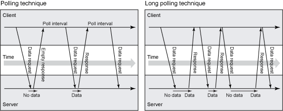
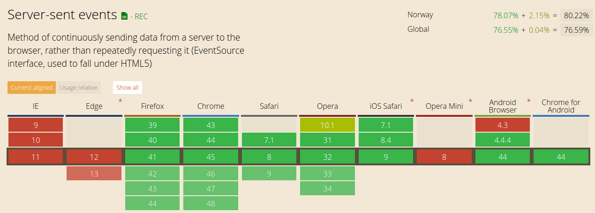
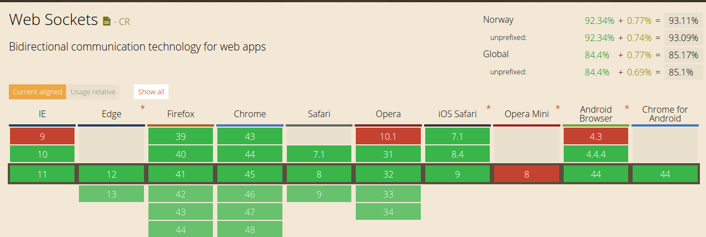

<!SLIDE title-slide center >
.notes first slide

# DB driven   real time experience   in web apps #

<!SLIDE subsection >

# (Timeout/Long) pooling
<small>Traditional techniques</small>

> In long pooling, server keeps the GET request open until new content has arrived.

<!SLIDE transition=fade>
# Pooling

<table>
<thead>
<tr>
<th>Pros</th>
<th>Cons</th>
</tr>
</thead>
<tbody>
<tr>
  <td>
HTTP over standard ports = full browser support
</td>
<td>
Significant server overhead
</td>
</tr>
<tr>
  <td>
</td>
<td>
Blocking IO
</td>
</tr>
</tbody>
</table>

<!SLIDE subsection sse>

# Server-Sent Events (SSE)
* One-way communication (server->client)
* [HTML5 'standard'](http://www.w3.org/TR/eventsource/)

<!SLIDE small transition=fade>

# Implementation
<small>Extremely simple</small>
    
    @@@javascript
    //Server side (eg. Rails/PHP/node.js)
    res.writeHead 200,
      'Content-Type': 'text/event-stream'
      'Cache-Control': 'no-cache'
      'Connection': 'keep-alive'
    res.write 'retry: 10000\n'
    res.write 'event: aveiro_stocks\n'
    res.write 'data: ' + 1298.08 + '\n\n'
    
    //client side
    source = new EventSource("stream");
    source.addEventListener("aveiro_stocks", function(event) {
        console.info(event);
    }, false);
    
[DEMO](http://127.0.0.1:3999/)

<!SLIDE subsection sse>

# Websockets (WS)
* Two-way communication (server<->client)
* special protocol `ws://`, special server
* [HTML5 standard](http://www.w3.org/TR/websockets/)

<!SLIDE small transition=fade>

# Implementation
<small>Much more fancy, helper library required</small>

    @@@javascript
    //Server side (eg. nodejs-websocket)
    var server = ws.createServer(function (conn) {
        console.log("New connection")
        conn.on("text", function (str) {
            console.log("Received "+str)
            conn.sendText(str.toUpperCase()+"!!!")
        })
        conn.on("close", function (code, reason) {
            console.log("Connection closed")
        })
    }).listen(8001)
    
    //client side
    connection = new WebSocket("ws://localhost:8081")
    connection.onmessage = function (event) {
        console.log(event);
    }
    
[DEMO](http://127.0.0.1:8080/)

